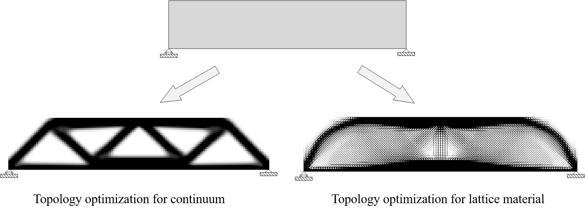
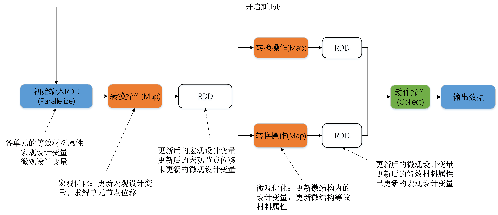
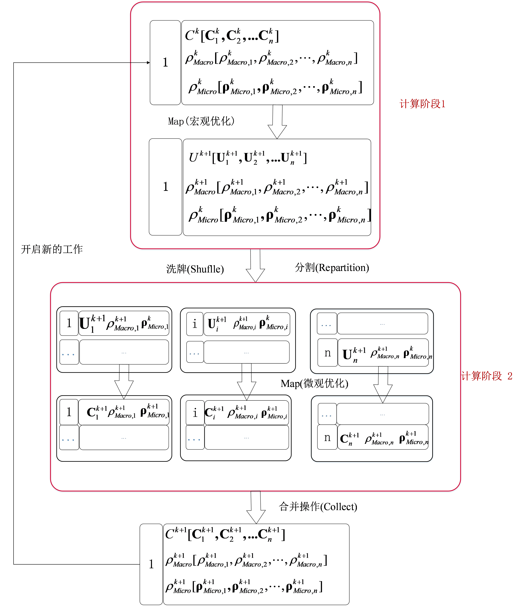
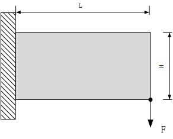
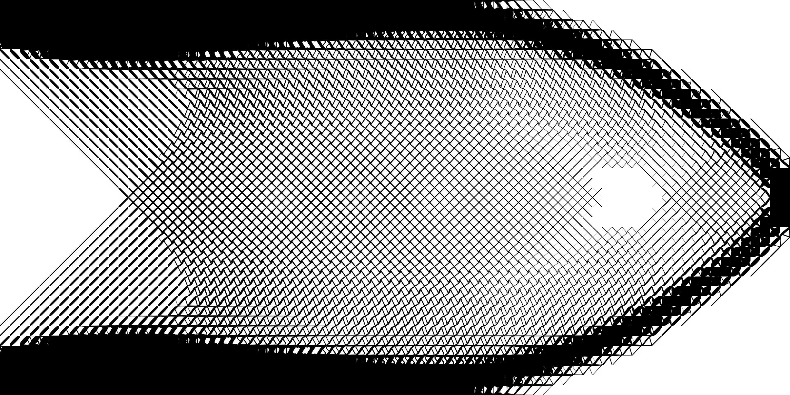
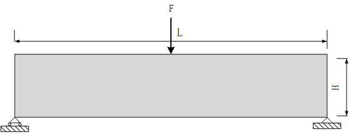
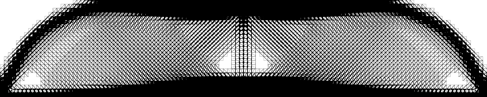

# Multiscale-Concurrent-Topology-Optimization-for-Lattice-Material
## Mutiscale-Optimization
* Multiscale optimization of lattice materials is a hot topic in the field of structural topology optimization,the picture below shows the difference of topology optimization between continuum structure and lattice material

## Distributed Parallel Optimization Method
* Our distributed parallel optimization is based on spark,the DAG is as follows:

## Numerical Example
* Boundary conditions of cantilevel beam and the topology result

* Boundary conditions of MMB and the topology result

# How to use?
*step1: you should have a spark enviroment* 
*step2: config the input in the parameter.xml which include mesh mode,boundary condition,cpu numbers to use,path for data writing and more.* 
*step3: Packaging the java code as jar file ,and submit to spark . There are two kinds of running mode of spark program.* 
* `--local mode`:in this mode,you can run the program on windows or linux 
* `--cluster mode`:in this mode ,you can run the program only on linux 
